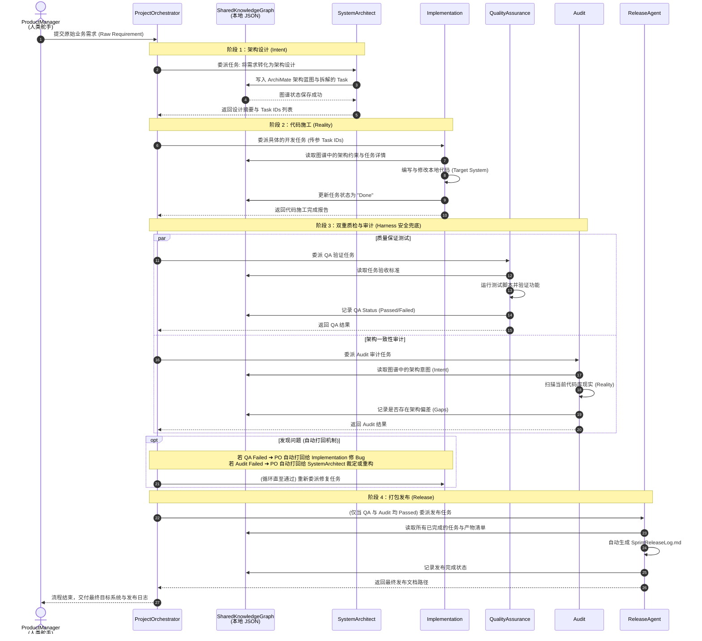

# 🚢 AI4PB: 你的 AI 自动化软件构建 Harness (航行指挥台)


> **AI4PB 是一套为你这艘巨轮配备的 Harness（工程指挥台）。它帮你协调一支全自动的 AI 船员团队来构建系统，而你，始终是掌握方向盘的舵手。**

## 🎯 直击痛点：为什么你需要 Harness？

今天，让 AI 写个简单的代码片段很容易，但让它**从零构建一个完整的软件系统**却极大概率会触礁沉没：
1. **经常偏航（失忆）**：聊到第三轮，AI 就忘了你最初定的目的地。
2. **盲目造船（无架构）**：没有图纸，想到哪拼到哪，最后系统根本跑不起来。
3. **各自为战（信息孤岛）**：写代码的 AI 和做测试的 AI 互不相通，一堆烂摊子。

**大模型就像动力强劲但没有导航的发动机。AI4PB 就是套在它外面的 Harness（指挥控制台）。** 它不负责发明新模型，而是用严苛的工程纪律约束 AI，强迫它们按照正规的航海流程（需求 -> 图纸 -> 施工 -> 测试 -> 核对）一步步推进。

## 🌟 这套Harness的核心

如果AI 编程工具依赖“历史聊天记录”来记事，极易错乱。AI4PB 通过以下独创的工程设计来解决上述痛点：

*   🗺️ **共享知识图谱（唯一的事实来源）**：
    这是 AI4PB 最强大的武器。我们将整个项目的需求、架构图纸、任务进度、报错信息，全部结构化地存在你本地的一个 `JSON` 文件里（这就好比全船人共用的一张 **“共享航海图”** ）。
    **不依赖聊天上下文！** “AI 架构师”画好的图纸，“AI 程序员”直接从图谱里读取来施工，“AI 测试员”对照图谱来验收。所有 AI 船员都在同一张图纸上读写，彻底消灭了 AI 的“金鱼记忆”和沟通障碍。
*   ⚖️ **严格的“意图 vs 现实”审计**：
    普通 AI 测完代码不报错就交差了。但 AI4PB 配备了专门的“审计员 (@Audit)”，它会扫描写出来的代码（造好的船），去对比知识图谱里的架构设计（原始图纸）。如果程序员私自修改了架构，审计员会立刻打回重做，把隐患扼杀在源头。

## 🧑‍✈️ 核心理念：AI 是船员，你是舵手

在 AI4PB 中，**人类绝不是被替代的对象，你是这艘船的最高指挥官（舵手）**：

*   **你负责设定航向（定目标）**：只需在控制台输入一句话的业务需求。
*   **AI 负责各司其职（走流程）**：指挥台会自动把任务派发给虚拟的“领航员”画架构、“轮机长”写代码、“质检员”去排雷。
*   **你随时手动接管（握住方向盘）**：因为共享知识图谱就是你本地的一个透明 `JSON` 文件，一旦遇到 AI 搞不定的暗礁，你可以随时用文本编辑器打开它手动修改，或者自己写完那段核心代码。驶出险区后你一松手，自动驾驶系统又会乖乖接管后续的工作。

## ⚙️ 极简工作流

你下达航向后，AI4PB 的“主控系统”会自动调度以下流程：

![[Pasted image 20260330155702.png]]



## 🚀 1 分钟快速起航 (极简安装)

得益于我们将庞大的知识图谱轻量化为**本地 JSON**，你不需要配置任何繁琐的数据库环境。**只需拷贝一个文件夹，立刻让任意项目拥有完整的 AI 船员团队。**

### 1. 准备基础环境
确保你的电脑安装了 Node.js，然后安装底层的 OpenCode 运行引擎：
```bash
npm install -g @opencode-ai/cli
```

### 2. 装载 Harness (即插即用)
进入你想要开发的项目目录（空文件夹或老项目都行），将本工具提供的 `.opencode` 文件夹**直接复制**进去。
```bash
cd your-target-project/
# 将 AI4PB 提供的 .opencode 文件夹完整拷贝到你的项目里
cp -r /path/to/ai4pb/.opencode ./
```
*(💡 秘密都在这：这个 `.opencode` 文件夹就是你的 Harness 指挥台，里面装载了所有的 AI 船员角色设定、自动化工具箱，以及作为“共享航海图”的本地 JSON 文件。)*

### 3. 舵手下达指令，扬帆起航！
在终端输入你的需求，唤醒主控系统，全自动构建正式开始：

```bash
opencode run --agent ProjectOrchestrator "我们需要一个带有用户登录和新闻聚合展示功能的前端门户应用，后端使用 Node.js，需保证密码加密存储。"
```

☕ **接下来，看着它们干活。**
你会在终端看到 AI 们依次排队：画架构、写代码、跑测试。一切讨论和状态都会实时记录到本地的 JSON 航海图中。如果代码不符合架构要求，它们会在内部打回重做，直到最终把完整的代码和发布日志交到你手上。

---

**带上这个 `.opencode` 文件夹，走上指挥台。是时候告别手摇式的提示词对话，体验现代化的 AI 自动化构建 Harness 了！**